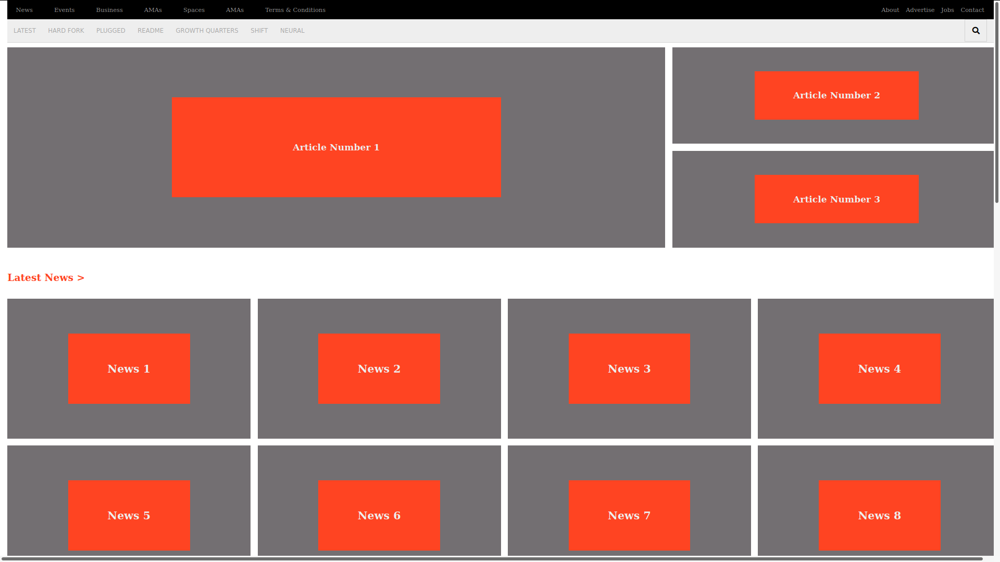

# responsive-design-tnw-clone

A Responsive Mobile, iPad, and Web page clone of The Next Web (https://thenextweb.com/). We used css grid and css flex to position all of the elements in this project. 

 
## Built With

- HTML5
- CSS
- Font Awesome

## Live Demo

[Live Demo Link](https://kimothokamau.github.io/responsive-design-tnw-clone/)

👤 **Railon Acosta**

- GitHub: [@railonA](https://github.com/RailonA)
- Linkedin: [@railonAcosta](https://www.linkedin.com/in/railon-acosta-81265180/)
- Twiter: [@railonAcosta](https://twitter.com/RailonAcosta)

👤 **Kimotho Kamau**

- GitHub: [@kimothokamau](https://github.com/kimothokamau)
- Twitter: [@kimothokk](https://twitter.com/kimothokk)

## 🤝 Contributing

Contributions, issues, and feature requests are welcome!

Feel free to check the [issues page](https://github.com/kimothokamau/responsive-design-tnw-clone/issues).

## Show your support

Give a ⭐️ if you like this project!

## 📝 License

This project is [MIT](LICENSE) licensed.
